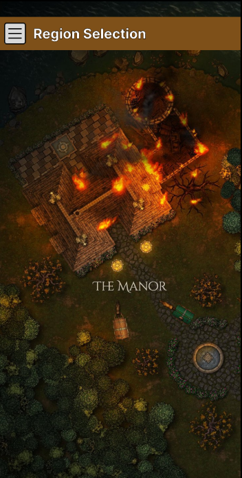
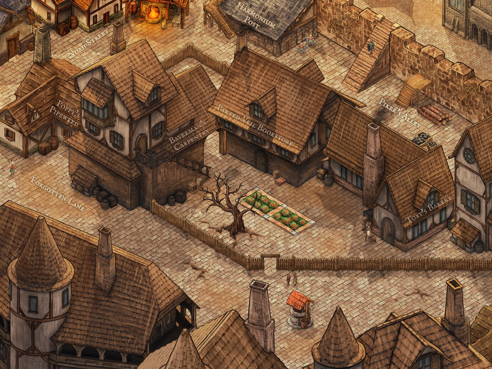
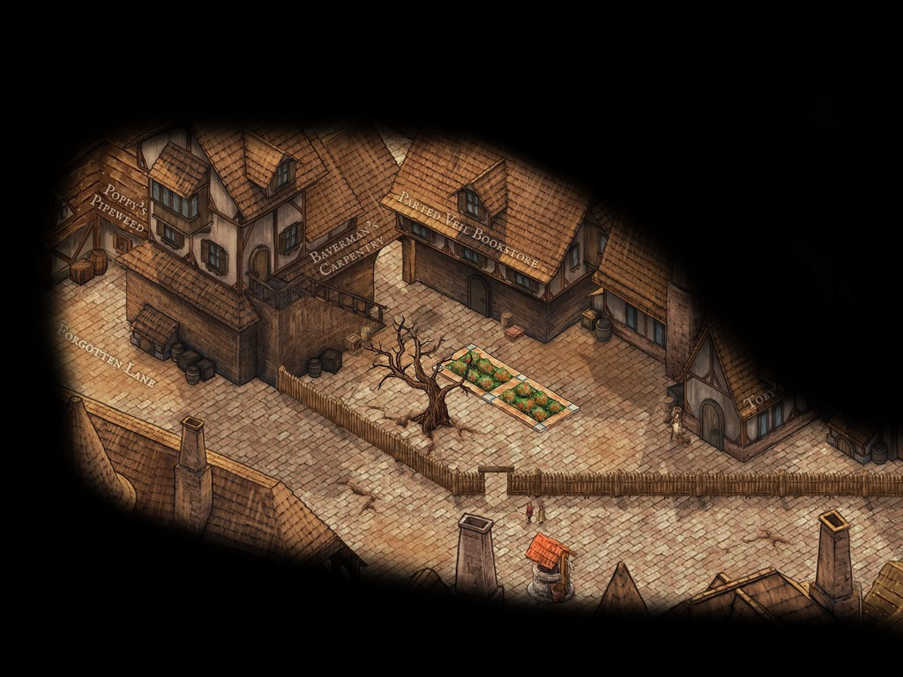
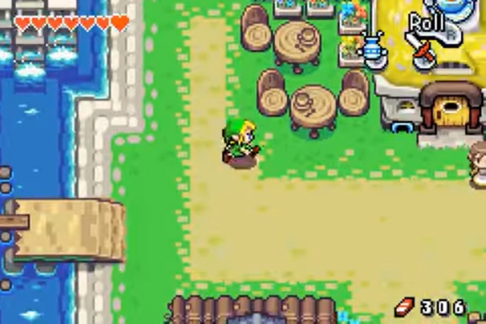
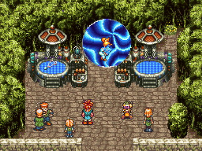

# 冒險 (Adventure)

## 介紹 (Introduction)
---

在遊戲裡玩家將先在出發前配置好隊伍的角色以及出發所需要的物品，之後在地圖中與各式各樣的地點與事件互動。每次從城鎮出發後所能夠帶回城鎮的戰利品都有一定的數量(重量)上限，將取決於角色的冒險設備(如馬車等級)或是角色的負重上限等等...。在探索的過程中，玩家將蒐集到各類型的新道具、遭遇特殊事件以及與不同的怪物戰鬥等等。獲得的新道具可以帶回城鎮中進行二次製作，成為角色提升能力的契機。

 

## 核心要素設計 Key Point
----------

- 未知性(迷霧、突然冒出的怪物)
- 支線的豐富度(主線簡化、豐富支線)
- 副本難度要小
- 大地圖斷層不能太明顯?
- 豐富收集要素的小遊戲

 

## 畫面設計
----------

為了要深度營造遊戲世界內探索的代入感，在地圖探索這方面必須要讓玩家對前方的事物有一定的未知性。在 3D 遊戲中這部分能夠以比較簡單的方式達成，但是在 2D 遊戲裡因為畫面設計的緣故免不了一些輔助系統的設置。目前想到的解決方式有兩種:

1. 使用戰爭迷霧覆蓋未探索的區域:

類似像世紀帝國2那樣，未探索的地方會黑黑一片，探索過的地方看的到輪廓等等，這種方式優點在於地圖設計的成本不會太高，對細節的繪製可以完全表現在一張圖片上，具體效果像是下面這樣:

這種方法在設計時有幾點可以考慮: 如探索過後的區域迷霧是否可以打開?

2. 將視野拉到更近的距離之下:

相較於前面提到的方法，這種方式較多對地圖細節的描繪以及補充，同時地圖開發的成本也較大，但是可以做到比較高的代入感。如:

 

## 流程 (Process)
-----------------

玩家進入地圖頁面後，可以在地圖上看到若干標示地點的字樣，地點為組成冒險地圖的基本單位，點擊地點後可以看到該地點所有的 NPC 或是怪物等等，接著會跳出可互動事件供玩家做選擇。

 

## 區域 (Region)
---

遊戲中的整個地圖由若干區域所組成，不同區域有該地區特有的物品、事件、敵人等等，玩家將在當中選擇自己喜歡的區域進行探索。一開始玩家皆會從起始區域出發，一步步地向大地圖其他地方進行探索。新區域的限制會隨著完成不同條件而跟著開放，例如打敗某隻 boss、蒐集完特定種類的道具、在該區域中探索達一定時間、完成某件任務....等等。

 